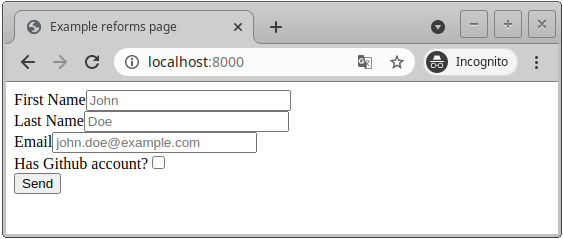

<p align="center">
  <a href="https://reforms.boardpack.org/"></a>
</p>
<!--<p align="center">
    <em>Reforms is a fresh pydantic-based forms validation and rendering library for Python 3.6+.</em>
</p>-->
<p align="center">
    <a href="https://github.com/boardpack/reforms/actions?query=workflow%3ATest" target="_blank">
        
    </a>
    <a href="https://codecov.io/gh/boardpack/reforms" target="_blank">
        
    </a>
    <a href="https://pypi.org/project/reforms" target="_blank">
        
    </a>
    <a href="https://github.com/psf/black"></a>
    <a href="https://pycqa.github.io/isort/" rel="nofollow"></a>
</p>

---

**Documentation**: <a href="https://reforms.boardpack.org" target="_blank">https://reforms.boardpack.org</a>

**Source Code**: <a href="https://github.com/boardpack/reforms" target="_blank">https://github.com/boardpack/reforms</a>

---

Reforms is a fresh pydantic-based forms validation and rendering library for Python 3.6+.

The key features are:

* **Familiar**: Expanded Pydantic retaining all data validation and model creation 
capabilities.
* **Easy**: Designed to be easy to use and learn. Less time reading docs.
* **Theming**: Supported the usage of existing template pack and the creation of your 
own.

## Requirements

Python 3.6+

Reforms has the next hard dependencies:

* <a href="https://pydantic-docs.helpmanual.io/" class="external-link" target="_blank">Pydantic</a> for the data parts.
* <a href="https://jinja.palletsprojects.com/" class="external-link" target="_blank">Jinja2</a> for the templates.

## Installation

<div class="termy">

```console
$ pip install git+http://github.com/boardpack/reforms

---> 100%
```

</div>

## Example

In the next example, we will use <a href="https://fastapi.tiangolo.com/" class="external-link" target="_blank">FastAPI</a>
as a web framework. So you need to install `fastapi` and `uvicorn` first. Also, you 
need to install `python-multipart` library to turn on forms support in FastAPI.

<div class="termy">

```console
$ pip install fastapi uvicorn python-multipart

---> 100%
```

</div>

### Create it

* Create a file `models.py` with `UserModel` pydantic model:

```Python
from pydantic import BaseModel

from reforms import StringField, BooleanField, EmailField
from reforms.validators import Required, Length


class UserModel(BaseModel):
    first_name: StringField(
        label="First Name",
        field_id="firstName",
        placeholder="John",
        validators=[Required(), Length(min=5)],
    )
    last_name: StringField(
        label="Last Name",
        field_id="lastName",
        placeholder="Doe",
        validators=[Required(), Length(min=5)],
    )
    email: EmailField(
        label="Email",
        field_id="email",
        placeholder="john.doe@example.com",
        validators=[Required()],
    )
    has_github: BooleanField(label="Has Github account?", field_id="hasGithub") = False

```
_(This script is complete, it should run "as is")_

* Then you can create a FastAPI application and use this model to generate form 
layout and validate data. Reforms has special `on_model` function, which works 
with `Depends` from FastAPI to convert raw form data into pydantic model object. 
Create a file `main.py` with:

```Python hl_lines="8 19 23 28"
import uvicorn
from fastapi import FastAPI, Request, Depends
from fastapi.responses import HTMLResponse, RedirectResponse
from fastapi.templating import Jinja2Templates
from starlette.status import HTTP_302_FOUND
from reforms import Reforms, on_model

from models import UserModel

app = FastAPI()

forms = Reforms(package="reforms")

templates = Jinja2Templates(directory="templates")


@app.get("/", response_class=HTMLResponse)
async def index(request: Request):
    user_form = forms.Form(UserModel)

    return templates.TemplateResponse(
        "index.html",
        {"request": request, "form": user_form},
    )


@app.post("/", response_class=RedirectResponse)
async def handle_form(form: UserModel = Depends(on_model(UserModel))):
    print(form)
    return RedirectResponse("/", status_code=HTTP_302_FOUND)


if __name__ == '__main__':
    uvicorn.run(app)

```
_(This script is complete, it should run "as is")_

* As the last coding step, you need to create a template (now **reforms** supports only 
**jinja2** templates). You can use just form object to render all fields 
simultaneously or render every field separately (as it mentions in the selected 
commented line).

```HTML hl_lines="10"
<!DOCTYPE html>
<html lang="en">
    <head>
        <meta charset="UTF-8">
        <title>Example reforms page</title>
    </head>
    <body>
        <form action="/" method="post">
            {{ form }}
            {#{{ form.first_name }}#}
            <br>
            <input type="submit" value="Send">
        </form>
    </body>
</html>
```
_(This template is complete, it should use "as is")_

### Run it

Run the server with:

<div class="termy">

```console
$ uvicorn main:app --reload

INFO:     Uvicorn running on http://127.0.0.1:8000 (Press CTRL+C to quit)
INFO:     Started reloader process [28720]
INFO:     Started server process [28722]
INFO:     Waiting for application startup.
INFO:     Application startup complete.
```

</div>

<details markdown="1">
<summary>About the command <code>uvicorn main:app --reload</code>...</summary>

The command `uvicorn main:app` refers to:

* `main`: the file `main.py` (the Python "module").
* `app`: the object created inside of `main.py` with the line `app = FastAPI()`.
* `--reload`: make the server restart after code changes. Only do this for development.

</details>

or just with:

<div class="termy">

```console
$ python main.py

INFO:     Uvicorn running on http://127.0.0.1:8000 (Press CTRL+C to quit)
INFO:     Started reloader process [28720]
INFO:     Started server process [28722]
INFO:     Waiting for application startup.
INFO:     Application startup complete.
```

</div>

### Send it

Open your browser at <a href="http://127.0.0.1:8000" class="external-link" target="_blank">http://127.0.0.1:8000</a>.

You will see the web form:



Add some information like this and click "Send" button:


### Check it

Finally, you can see a printed validated model object in your console:

```bash hl_lines="8"
INFO:     Uvicorn running on http://127.0.0.1:8000 (Press CTRL+C to quit)
INFO:     Started reloader process [28720]
INFO:     Started server process [28722]
INFO:     Waiting for application startup.
INFO:     Application startup complete.

INFO:     127.0.0.1:33612 - "GET / HTTP/1.1" 200 OK
first_name='Roman' last_name='Dukkee' email='example@example.com' has_github=True
INFO:     127.0.0.1:33872 - "POST / HTTP/1.1" 302 Found
INFO:     127.0.0.1:33872 - "GET / HTTP/1.1" 200 OK
```

## Acknowledgments

Special thanks to:

 * [Sebastián Ramírez](https://github.com/tiangolo) and his [FastAPI](https://github.com/tiangolo/fastapi) project,  some scripts and documentation structure and parts were used from there.
 
 * [Samuel Colvin](https://github.com/samuelcolvin) and his [Pydantic](https://github.com/samuelcolvin/pydantic/) project.

## License

This project is licensed under the terms of the MIT license.
